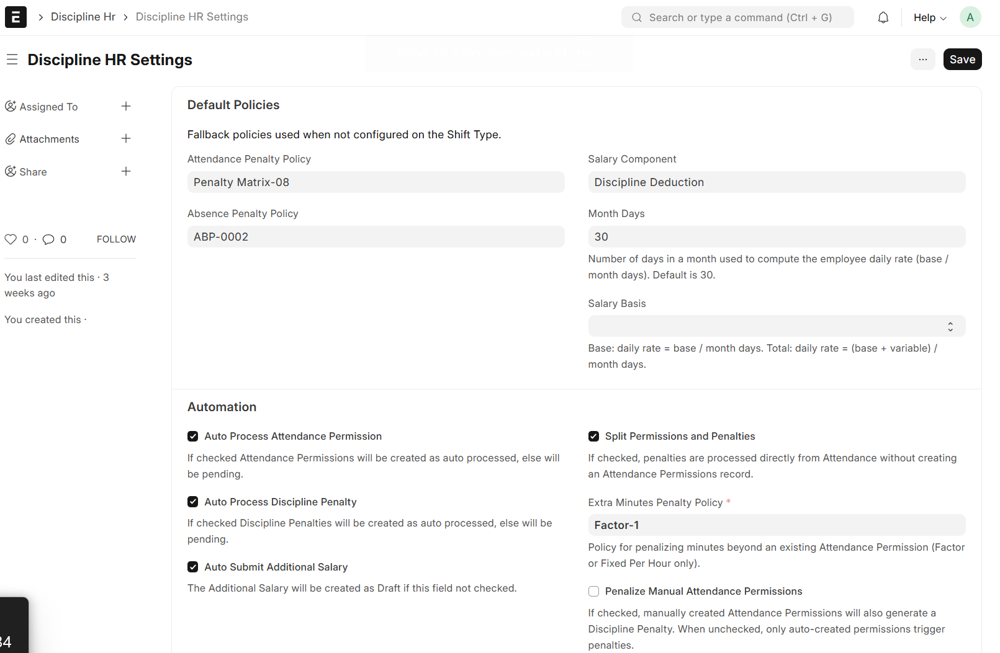
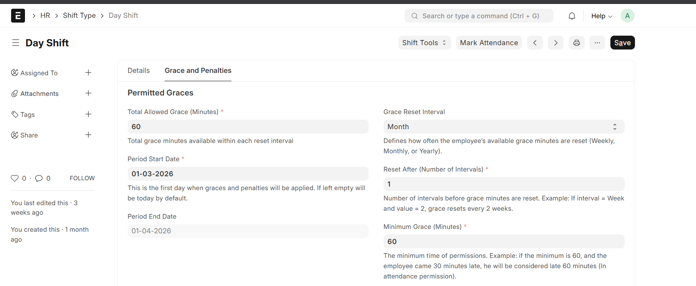
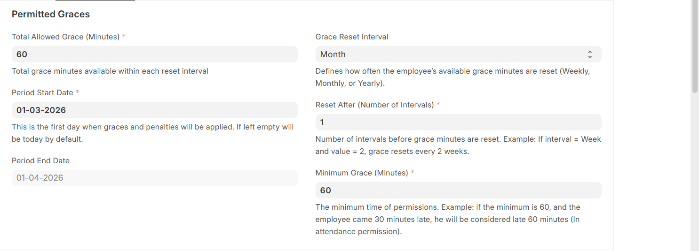
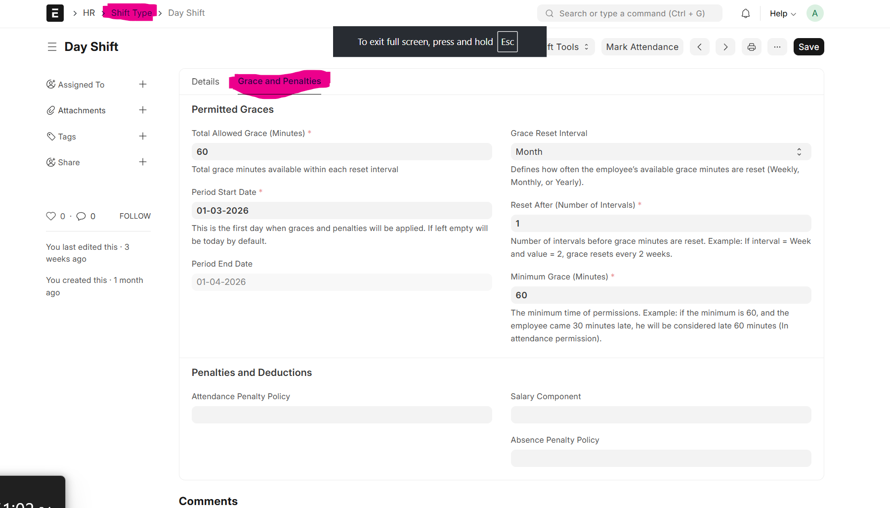
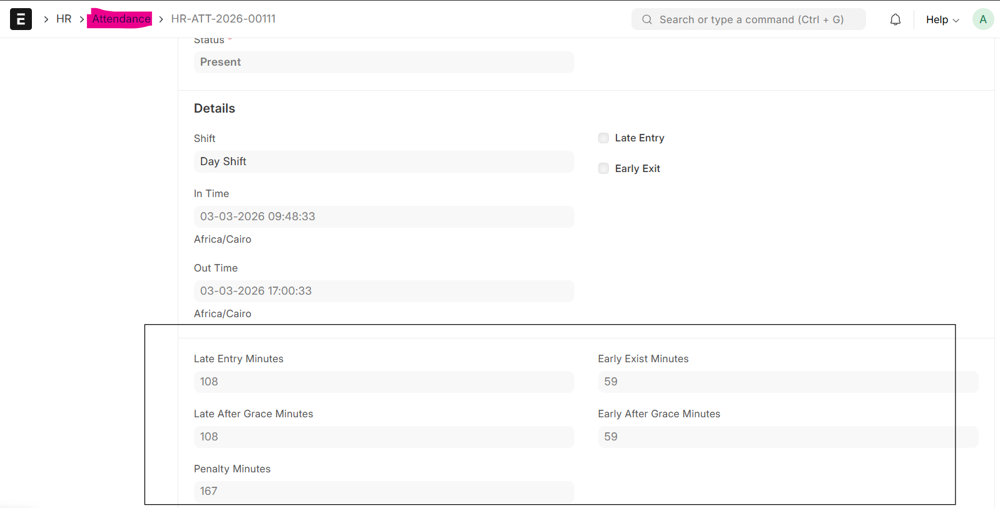
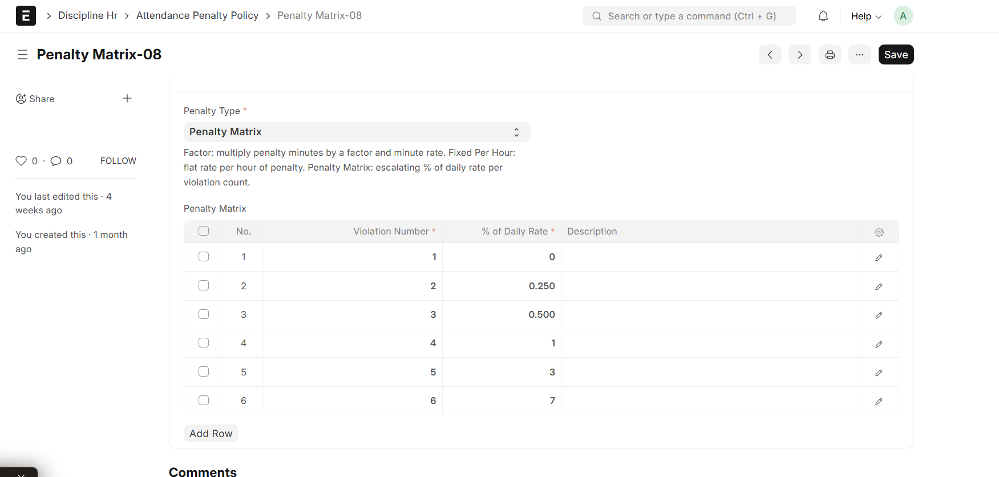
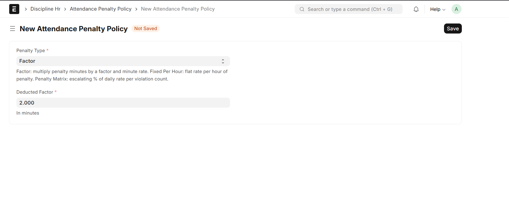
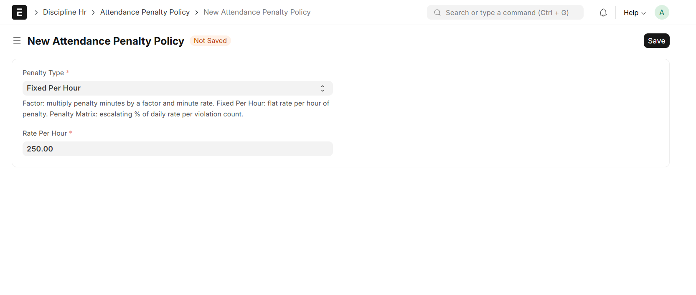

<p align="center">
  
</p>

# Discipline HR

Smart time tracking, grace minutes, and salary penalties for ERPNext HR.

Frappe HRMS already tracks attendance, leaves, and late entries. **Discipline HR** adds three things on top: a pool of grace minutes per employee, a clear record of how many minutes are left, and an automatic salary penalty when an employee goes over the limit or is absent without permission.

---

## Quickstart

Get a working penalty in under 10 minutes.

### 1. Install

Run from your bench folder:

Discipline HR needs Frappe HRMS. Install it first if it is not already on your bench:

```bash
cd ~/frappe-bench
bench get-app hrms
bench --site $SITE_NAME install-app hrms
```

Then install Discipline HR:

```bash
bench get-app https://github.com/Cre8tivMaxx/discipline_hr --branch develop
bench --site $SITE_NAME install-app discipline_hr
bench --site $SITE_NAME migrate
```

### 2. Set a default policy

Open **Discipline HR Settings** and pick:

- A default **Attendance Penalty Policy** (for late entry and early exit).
- A **Salary Component** to use for the deduction.



### 3. Give one shift a grace pool

Open any **Shift Type** and set:

- **Total Allowed Grace Minutes** — for example, `120` (2 hours per period).
- **Grace Reset Interval** — `Monthly`.
- **Period Start Date** and **Period End Date** — the first month.



### 4. Submit a late Attendance

Submit an Attendance for an employee on this shift, with a late entry larger than 120 minutes.

You will see:

- An **Employee Grace Ledger** entry shows the minutes used.
- A **Discipline Penalty** is created with the deduction amount.

If you wanted to excuse the lateness ahead of time, you would have created an **Attendance Pre-Authorization** for that employee and date before submitting the attendance — the app would have consumed it instead of (or in addition to) charging the grace pool.

That's it, keep exploring different policies.

---

## How it works

When an employee submits an Attendance, the app runs two flows depending on whether HR has pre-authorized the late entry / early exit.

**No pre-authorization on file** (the default flow):

1. Reads the shift's grace pool and the minutes already used in this period.
2. Saves the late and early minutes on the Attendance.
3. Adds a row to the **Employee Grace Ledger** to track minutes used.
4. Creates a **Discipline Penalty** with the amount to deduct from salary, when the grace pool is exhausted.

**Approved pre-authorization on file** for the same employee and date:

1. Saves the late and early minutes on the Attendance.
2. Atomically marks the **Attendance Pre-Authorization** as `Consumed`.
3. If the actual minutes are within the pre-authorized minutes, no penalty and no grace ledger entry are created — the pre-auth is the contract.
4. If the actual minutes exceed the pre-authorized minutes, a **Discipline Penalty** is created for the surplus minutes using the dedicated **Pre-Authorization Surplus Policy** in Discipline HR Settings. The grace pool is **not** touched.



If any step fails, the Attendance shows the traceback in its **Error Log** field, and a **Retry** button appears on the document so HR can run the pipeline again. While an Attendance has an unresolved error or a pending Penalty in the payroll period, the app blocks the Salary Slip from submitting — so a broken step never silently turns into a wrong paycheck.

When an Attendance is **cancelled**, the app cascades: the Discipline Penalty and Additional Salary are removed, the Grace Ledger entry is deleted, and any Consumed pre-authorization is reverted to `Approved` so an amended re-submit can re-consume it (one consumption per submit cycle).

---

## Configuration reference

### Shift Type fields



| Field                       | Description                                                                                                       |
| --------------------------- | ----------------------------------------------------------------------------------------------------------------- |
| Period Start / End Date     | The date range when penalties apply. The app rolls these forward when the period ends.                            |
| Total Allowed Grace Minutes | The grace pool shared across the whole period.                                                                    |
| Minimum Grace Minutes       | The smallest charge per attendance event. If an employee is 20 minutes late but the minimum is 60, the ledger records 60. |
| Grace Reset Interval        | How often the pool resets: Weekly, Monthly, or Yearly.                                                            |
| Reset After (Intervals)     | How many intervals before reset. For example, reset every 2 months.                                               |
| Attendance Penalty Policy   | Replaces the default attendance policy for this shift.                                                            |
| Absence Penalty Policy      | Replaces the default absence policy for this shift.                                                               |
| Salary Component            | Replaces the default salary component for this shift.                                                             |

### Attendance fields (filled by the app)



| Field              | Description                                                                  |
| ------------------ | ---------------------------------------------------------------------------- |
| Late Entry Minutes | The actual minutes late.                                                     |
| Late After Grace   | Minutes left to penalize after using the grace pool.                         |
| Early Exit Minutes | The actual minutes early.                                                    |
| Early After Grace  | Minutes left to penalize after using the grace pool.                         |
| Penalty Minutes    | Total minutes to penalize (Late After Grace + Early After Grace).            |
| Error Log          | Any errors raised during the background calculation.                         |

### Discipline HR Settings

- **Attendance Penalty Policy** — main policy for grace-pool exhaustion penalties.
- **Pre-Authorization Surplus Policy** — policy used when an Attendance exceeds an Approved Pre-Authorization. Only `Factor` and `Fixed Per Hour` policies are valid here.
- **Absence Penalty Policy** — used when an employee is marked Absent.
- **Salary Component** — the component for the Additional Salary deduction.
- **Salary Basis** — use `Base` salary or `Total` salary for the daily rate.
- **Month Days** — days in a month for the daily rate (default `30`).
- **Auto Approve Pre-Authorization** — if on, newly created Drafts jump straight to `Approved`. If off, HR must approve manually.
- **Auto Process Attendance Penalty** — if on, Discipline Penalties are created in `Auto Processed` state; if off, they wait in `Pending`.

---

## Penalty policies

### Attendance Penalty Policy (late and early)

Pick one:

1. **Factor** — `penalty_minutes × factor × (daily_rate ÷ shift_hours ÷ 60)`
2. **Fixed Per Hour** — a flat rate per hour of penalty.
3. **Penalty Matrix** — a growing percent of daily rate per violation in the period (day 1 a warning, day 2 a `25%` deduction, and so on).





### Absence Penalty Policy (unpermitted absence)

Pick one:

1. **Penalty Matrix** — percent of daily rate based on number of absences.
2. **Special Days** — different percent for some weekdays. For example, `200%` deduction on Sundays.
3. **Matrix & Special Days** — uses both rules together.

---

## Workflow statuses

**Attendance Pre-Authorization** statuses:

| Status            | Meaning                                                                  |
| ----------------- | ------------------------------------------------------------------------ |
| Draft             | Being prepared — not yet submitted for HR action.                        |
| Pending Approval  | Waiting for HR approval.                                                 |
| Approved          | Active and ready to be consumed by a matching Attendance submit.         |
| Consumed          | Used by an Attendance submit. Reverts to Approved if the Attendance is cancelled. |
| Rejected          | Refused by HR — never consumed.                                          |
| Expired           | Daily scheduler marks unconsumed records older than 7 days as expired.   |

**Discipline Penalty** statuses:

| Status         | Meaning                                |
| -------------- | -------------------------------------- |
| Auto Processed | Created without manual HR action.      |
| Pending        | Waiting for HR or manager action.      |
| Accepted       | Approved — flows into the Salary Slip. |
| Rejected       | Waived — no salary deduction.          |

---

## Reports

The app ships four script reports under the **Discipline HR** workspace:

| Report                                | Purpose                                                                                                              |
| ------------------------------------- | -------------------------------------------------------------------------------------------------------------------- |
| Employee Grace Ledger Report          | Drill-down of every grace-pool movement for one employee in a shift period — investigate how the pool was consumed.  |
| Monthly Penalty Summary               | Payroll roll-up: one row per (employee, period, salary component) with total minutes and amount. Run before payroll. |
| Discipline Penalty Register           | Line-level audit log of every penalty (Draft, Submitted, Cancelled), filterable by department, policy, error state.  |
| Attendance Pre-Authorization Pipeline | Operational triage view of Pre-Authorizations — Pending Approval vs Approved vs Consumed, oldest-first.              |

---

## Scheduled jobs and guards

- **Daily Grace Rollover** — a daily scheduled job moves the **Period Start** and **Period End** dates on Shift Types when the current period ends.
- **Daily Pre-Authorization Expiry** — Drafts, Pending, and Approved Pre-Authorizations whose date is older than 7 days are marked `Expired` so they can no longer be consumed.
- **Salary Slip Guard** — the app blocks Salary Slip submission if the employee has Attendances with errors or penalties that are still pending in the payroll period.

---

## Future work

- **Employee self-service requests** — let employees raise a Pre-Authorization in `Pending Approval` themselves; HR reviews and approves before the attendance date.
- **Configurable expiry window** — make the 7-day expiry per-shift instead of a global constant, and lift it to Discipline HR Settings.
- **More attendance penalty policies** — beyond `Factor`, `Fixed Per Hour`, and `Penalty Matrix`: tiered hourly rates, time-of-day surcharges (e.g. higher rate for the first 15 minutes), capped daily/monthly maximums, and policies that escalate by recent violation streak rather than period total.
- **More absence penalty policies** — beyond `Penalty Matrix`, `Special Days`, and `Matrix & Special Days`: consecutive-absence escalation (each next day costs more), per-department or per-grade rules, and pre-approved-leave-aware policies that downgrade the deduction when leave was filed late.
- **Manual attendance entry** — support businesses without biometric integration by allowing HR to record manual attendance and manual late entries / early exits, while still feeding into the same grace-ledger and penalty pipeline.

---

## Contributing

This app uses `pre-commit` for formatting and linting. [Install pre-commit](https://pre-commit.com/#installation), then enable it for this repo:

```bash
cd apps/discipline_hr
pre-commit install
```

Run all checks at any time with:

```bash
pre-commit run --all-files
```
